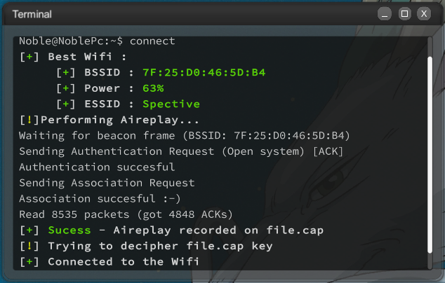

```
  _____                       _    _            _           _____           _       _       
 / ____|                     | |  | |          | |         / ____|         (_)     | |      
| |  __ _ __ ___ _   _ ______| |__| | __ _  ___| | _______| (___   ___ _ __ _ _ __ | |_ ___ 
| | |_ | '__/ _ \ | | |______|  __  |/ _` |/ __| |/ /______\___ \ / __| '__| | '_ \| __/ __|
| |__| | | |  __/ |_| |      | |  | | (_| | (__|   <       ____) | (__| |  | | |_) | |_\__ \
 \_____|_|  \___|\__, |      |_|  |_|\__,_|\___|_|\_\     |_____/ \___|_|  |_| .__/ \__|___/
                  __/ |                                                      | |            
                 |___/                                                       |_|            
```

# Noble Scripts

## Feel free to use any of my scripts to make your game better!

Hi! I'm Noble. Feel free to contact me in order to get scripts that I cannot make public!

## Scripts

I will categorize the game scripts in 2:

- Usefull : **What you will use to hack others and monitor your servers**
- Better Game Experience : **Provide the game information in a better way**
  <br/><br/>

|          | Usefull            | Better Game Experience |
| -------- | ------------------ | ---------------------- |
| whois    | :x:                | :heavy_check_mark:     |
| connect  | :heavy_check_mark: | :x:                    |
| decipher | :heavy_check_mark: | :x:                    |
| LogW     | :heavy_check_mark: | :x:                    |
| libinf   | :heavy_check_mark: | :x:                    |
| hall     | :heavy_check_mark: | :x:                    |

<br/>

### whois

This script only provides the information of whois in a better way.\
You can see in the image both the Grey Hack whois script and my whois script
<br/><br/>


### connect

This script will pick the best network available. After that, it will run aireplay, with the best network and the ACKs that we input. \
To get the right ACKs, I used this table:


At first, I thought about using polynomial interpolation and use the Newton method to find the right equation to calculate the perfect value of packets, until I realize that all I have to do is:

$$
\huge ACKs = \frac{300 000}{Signal\ Power}
$$

It's as simple as that.

Once aireplay is done, it will use the file.cap , decipher the password and connect to the wifi, deleting the file.cap and closing the script!



## decipher

This is a better decipher tool , you can pass both a file or copy paste the contents of the Mail,Bank and passwd files to decipher the password needed

- decipher -f NameFile
- decipher rweerqwr:123jk1213h123jh1231jh31

## LogW

This script deletes your logs every X defined seconds, to ensure that no one will catch your IP in the server that you are hacking from.
**Warning , This Script Only Works With Sudo** 

- LogW 10 
